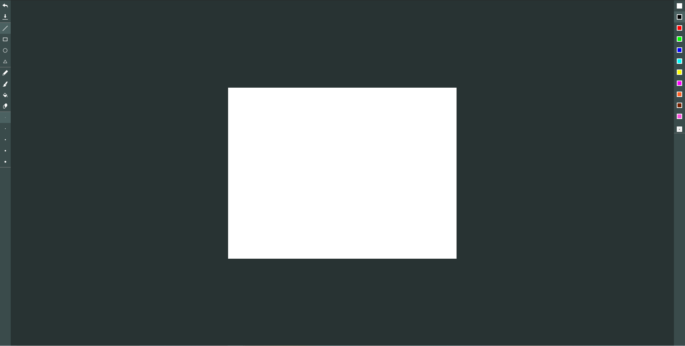

# Paint-App
---
You will learn to build tools to draw;  
1. Shapes like rectangle,circle,triangle and line.  
2. Paint brush.  
3. Paint bucket using the FLOOD FILL ALGORITHM.

---
# Tools
An IDE of your choice, Visual Studio Code is recommended.  
XAMPP or WAMP to run local Host on any browser.  

---
# Interface
This is the final look of your project.  

---
## License and Copyright 
© Asad Imtiaz Rana,  <asadimtiaz711@gmail.com>
